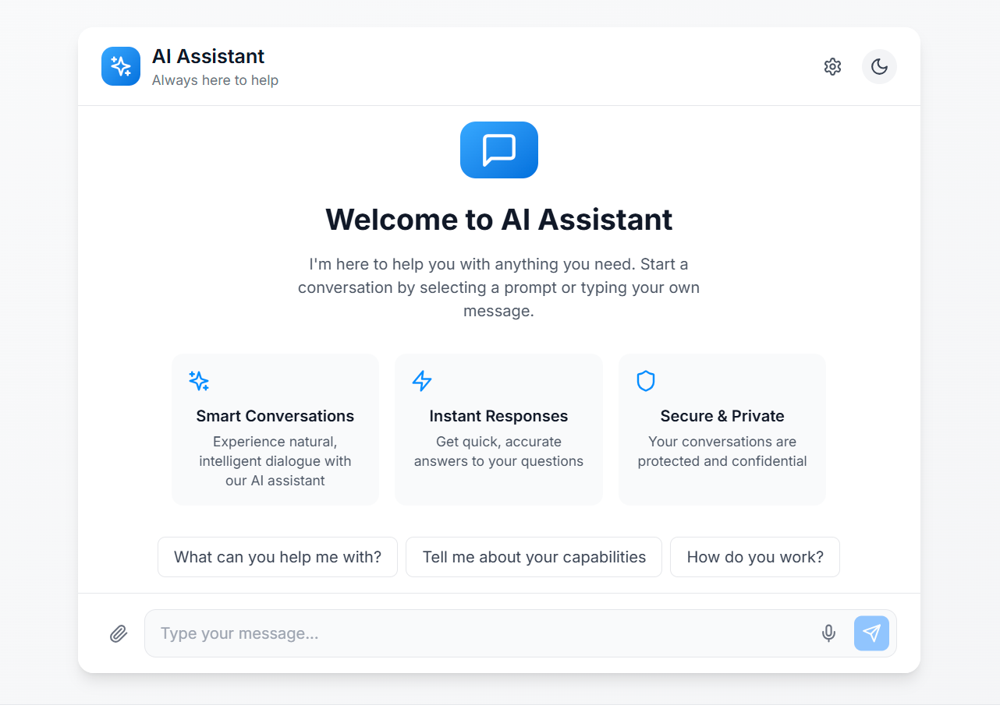
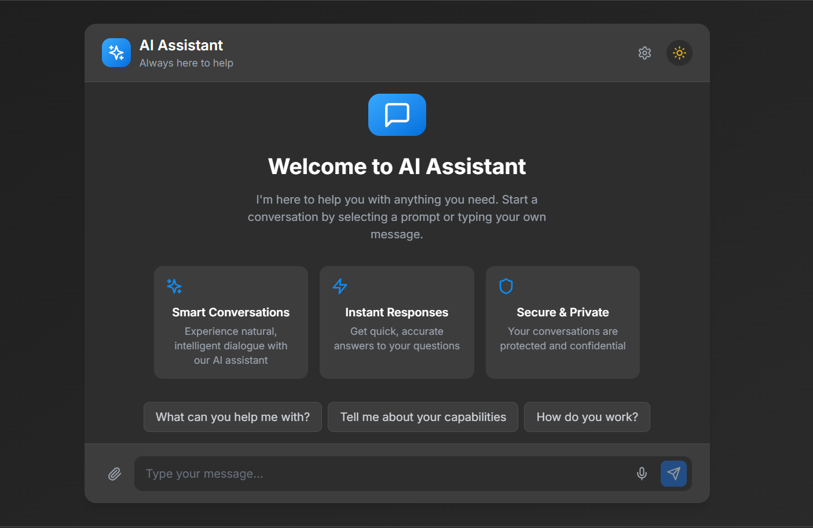
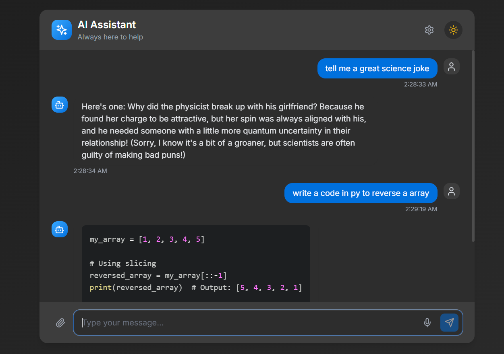

# AI Chat Application

[](LICENSE)
[](https://nodejs.org/)

> An **AI-powered chat application** built with Express.js on the backend and React (Next.js) on the frontend. It uses Groq's AI models to generate intelligent, real-time responses based on user input.

## 📸 Screenshots

### Homepage with Pre-built Prompts

<div align="center">
  <table>
    <tr>
      <td align="center">
        
        <br>
        <em>Light Mode</em>
      </td>
      <td align="center">
        
        <br>
        <em>Dark Mode</em>
      </td>
    </tr>
  </table>
  <p>The homepage features pre-built prompts that users can click to quickly start conversations with the AI.</p>
</div>

### Chat Interface with Code Generation

<div align="center">
  
  <p>The chat interface showing interaction between the user and AI, including code generation with copy functionality.</p>
</div>

## ✨ Features

- **🤖 AI-Powered Chat:** Seamlessly interact with an intelligent assistant powered by Groq's models
- **💡 Pre-built Prompts:** Quick-start conversations with curated prompt suggestions
- **📋 Code Generation & Copying:** Get code snippets with one-click copy functionality
- **⚡ Real-Time Responses:** Enjoy fast, natural conversational experiences
- **🌓 Dark & Light Modes:** Choose your preferred visual theme for comfortable usage
- **📱 Responsive Design:** Optimized for both desktop and mobile devices
- **🔧 Modern Tech Stack:** Built using Express.js (backend) and Next.js with React (frontend)

## 🚀 Getting Started

### Prerequisites

- **Node.js** (v14 or above)
- **npm** (or yarn)
- **Groq API Key:** Required for accessing Groq's AI models

### Installation

#### Backend Setup

1. **Clone the Repository**

   ```bash
   git clone https://github.com/amanraj8848/ai-chat-app.git
   cd ai-chat-app
   ```

2. **Navigate to the Backend Directory**

   ```bash
   cd backend
   ```

3. **Install Dependencies**

   ```bash
   npm install
   ```

4. **Configure Environment Variables**

   Create a `.env` file in the backend directory and add:

   ```env
   GROQ_API_KEY=your_groq_api_key_here
   PORT=5000
   ```

5. **Start the Backend Server**

   ```bash
   npm start
   ```

   The backend server will be running at http://localhost:5000.

#### Frontend Setup

1. **Navigate to the Frontend Directory**

   ```bash
   cd ../frontend
   ```

2. **Install Dependencies**

   ```bash
   npm install
   ```

3. **Configure Environment Variables**

   Create a `.env` file in the frontend directory with the following:

   ```env
   VITE_APP_API_URL=http://localhost:5000
   ```

4. **Start the Frontend Development Server**

   ```bash
   npm run dev
   ```

   The frontend will be available at http://localhost:3000.

## 💡 Usage

1. **Open the Application:**
   Navigate to http://localhost:3000 in your browser.

2. **Start Chatting:**
   - Click on a pre-built prompt to quickly begin a conversation
   - Or type your own message in the input field
   - Press Enter or click the Send button to submit

3. **Working with Code:**
   - When the AI generates code, a copy button appears
   - Click the copy button to copy the code to your clipboard
   - Code blocks are syntax-highlighted for better readability

4. **Additional Features:**
   - Toggle between dark and light themes using the theme toggle button
   - Clear conversation history when needed
   - Enjoy responsive design across different devices

## 🔍 Project Structure

```
ai-chat-app/
├── .qodo
├── backend/
│   ├── models/
│   ├── node_modules/
│   ├── src/
│   │   ├── models/
│   │   └── routes/
│   │       ├── chat.ts         # Express route for handling chat messages
│   │       └── index.ts        # Main entry point for the backend server
│   ├── .env                    # Environment variables for backend
│   ├── .gitignore
│   ├── package-lock.json
│   ├── package.json            # Backend dependencies and scripts
│   └── tsconfig.json           # TypeScript configuration for the backend
├── frontend/
│   ├── .bolt
│   ├── .qodo
│   ├── node_modules/
│   ├── src/
│   │   ├── components/
│   │   │   ├── ChatInput.tsx   # Component for the message input area
│   │   │   ├── ChatMessage.tsx # Component for rendering individual chat messages
│   │   │   ├── Footer.tsx      # Footer component
│   │   │   ├── ThemeToggle.tsx # Component to toggle UI themes (dark/light)
│   │   │   └── WelcomeScreen.tsx # Welcome screen component for first-time users
│   │   ├── lib/
│   │   │   └── api.ts          # API client for backend communication
│   │   ├── App.tsx             # Main application component
│   │   ├── index.css           # Global CSS styles
│   │   ├── main.tsx            # Entry point for the React application
│   │   └── vite-env.d.ts       # TypeScript declarations for Vite
│   ├── .env                    # Environment variables for frontend
│   ├── .gitignore
│   ├── .eslint.config.js       # ESLint configuration
│   └── index.html              # HTML entry point
└── screenshots/                # Application screenshots
    ├── chat.png                # Chat interface screenshot
    ├── home_dark.png           # Home screen in dark mode
    └── home_light.png          # Home screen in light mode
```

## 🛠️ Technology Stack

- **Frontend:**
  - React with Next.js
  - TypeScript
  - CSS/SCSS for styling
  - Axios for API requests

- **Backend:**
  - Express.js
  - TypeScript
  - Groq API integration for AI model access

## 🤝 Contributing

Contributions are welcome! Here's how you can contribute:

1. **Fork the Repository**

2. **Create a New Branch**

   ```bash
   git checkout -b feature/your-feature-name
   ```

3. **Commit Your Changes**

   ```bash
   git commit -m "Add your feature description"
   ```

4. **Push to the Branch**

   ```bash
   git push origin feature/your-feature-name
   ```

5. **Open a Pull Request** on GitHub

## 📄 License

This project is licensed under the MIT License - see the [LICENSE](LICENSE) file for details.

## 🙏 Acknowledgements

- **Groq:** For providing the powerful AI models
- **React.js and Next.js:** For the modern frontend framework
- **Express.js:** For the robust backend framework
- **Framer Motion:** For interactive animations
- **Lucide Icons:** For beautiful iconography

---

<div align="center">
  <p>Made with ❤️ by <a href="https://github.com/amanraj8848">Aman Raj</a></p>
  <p>Star ⭐ this repository if you find it helpful!</p>
</div>